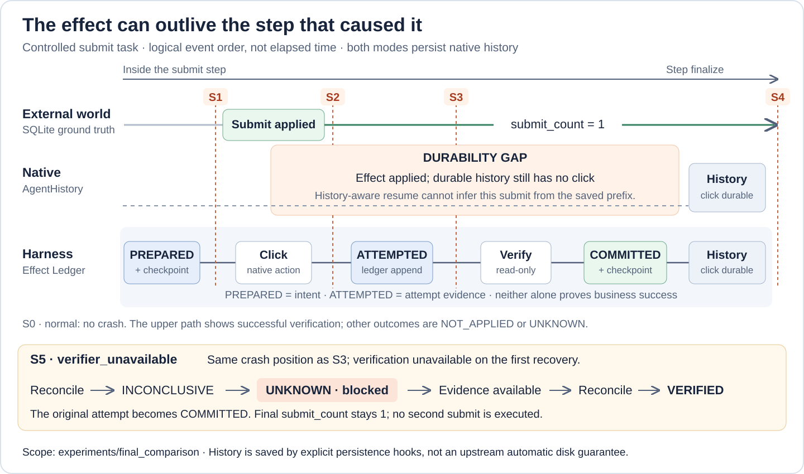

# 面向长链 Web Agent 的可恢复执行 Runtime

[English](README.md) | [简体中文](README.zh-CN.md)

[](https://github.com/Vaebanana/recoverable-runtime/actions/workflows/test.yaml)

**基于 Browser Use v0.13.10 的崩溃恢复与副作用安全执行层。** 持久化执行意图，查明结果未知的历史操作，让 Agent 安全继续任务，避免盲目重复提交。

**240 次受控实验 · 6 个场景 · 每个模式、每个场景重复 20 次**

| 模式 | 安全恢复率 | 重复副作用率 |
| --- | ---: | ---: |
| Native AgentHistory | 50.0% | 50.0% |
| **Recoverable Harness** | **100.0%** | **0.0%** |

两种模式的任务完成率均为 100%；安全恢复还要求外部提交恰好一次，且没有不安全重试。以上为等权脚本场景的实验结果，不代表生产环境故障概率。[查看已提交的正式结果](experiments/final_comparison/results/summary.md)。

[架构设计](docs/recoverable-runtime/architecture.md) · [实验方法](docs/recoverable-runtime/experiments.md) · [复现实验](#复现实验)

## 崩溃窗口：副作用已发生，History 尚未落盘

**提交可能已经改变外部世界，但对应的 Browser Step 还没有写入持久化 AgentHistory。** 本实验两种模式都在 Step finalize 时保存 History；Harness 还在 Step 内部记录执行意图与尝试证据，恢复时先查明未闭合 attempt 的结果，再决定能否重新提交。



图中展示正常提交路径及实际故障注入位置。S0 是无崩溃对照；S5 在 S3 崩溃位置的基础上，增加恢复阶段的验证不可用条件。

| 编号 | 场景 | 崩溃时的状态 / 对照条件 |
| --- | --- | --- |
| S0 | `normal` | 不注入崩溃，正常执行与验证。 |
| S1 | `before_effect` | Harness 的 `PREPARED` 和 Checkpoint 已落盘，尚未执行提交。 |
| S2 | `after_effect_before_attempted` | 外部 `submit_count = 1`；Harness 仅有 `PREPARED`，持久化 History 尚无 click。 |
| S3 | `after_attempted_before_history` | 外部 `submit_count = 1`；`ATTEMPTED` 已落盘，持久化 History 仍无 click。 |
| S4 | `after_history_commit` | 两种模式的持久化 History 都已有 click；Harness 已完成验证并提交副作用结果。 |
| S5 | `verifier_unavailable` | 初始崩溃点与 S3 相同；首次恢复观察无法得出结论，Harness 保持 `UNKNOWN` 并阻止执行，等待证据恢复。 |

`PREPARED` 只证明执行意图已记录，不能证明副作用已发生或未发生；`ATTEMPTED` 记录执行尝试，也不等于业务成功。最终由 Verification / Reconciliation 确定 `COMMITTED`、`NOT_APPLIED` 或 `UNKNOWN`。

这里的 History 落盘由实验 / Harness 在 `_make_history_item` 后的持久化钩子实现，不能理解成上游 AgentHistory 默认自动提供磁盘持久化。实现见：[故障注入](experiments/final_comparison/worker.py)、[Native History 持久化](experiments/final_comparison/history.py)、[Harness 集成](browser_use/recovery/harness.py)。

---

## 项目新增了什么

```text
Browser Use Agent
       |
       v
Semantic Task Contract
       |
       v
Recoverable Harness
       |
       +--> Runtime State
       |
       +--> Effect Ledger --------+
       |                          |
       +--> Checkpoint            |
       |                          v
       +--> Verification --> Reconciliation
                                  |
                                  v
                            Safe Resume / Retry
```

核心能力：

- **Semantic Task Contract（语义任务契约）**：在易变化的 Browser Step 和自然语言 Plan 之上，引入相对稳定的语义执行单元。
- **Durable Effect Ledger（持久化副作用账本）**：记录外部副作用从 `PREPARED -> ATTEMPTED -> COMMITTED / NOT_APPLIED / UNKNOWN` 的事实链。
- **Checkpoint + SQLite 持久化**：保存 Unit Runtime State 和 Effect Ledger 游标，用于进程崩溃后的状态恢复。
- **Verification（验证）**：通过只读观察确认真实后置条件，而不是仅相信模型声称“任务完成”。
- **Reconciliation（对账）**：针对结果未知的历史 attempt 进行观察和确认，不产生新的外部执行 attempt。
- **Recovery Safety Gate（恢复安全门）**：只要旧副作用结果仍不确定，就禁止重新执行。
- **Fault Injection（故障注入）**：在持久化边界附近主动注入崩溃，验证恢复逻辑，而不是只测试普通 Python 异常。
- **Browser Use 集成**：保留原生 Browser Use Agent 与浏览器执行链路，在其外部增加可恢复运行层。

更详细的设计说明见：[docs/recoverable-runtime/architecture.md](docs/recoverable-runtime/architecture.md)

---

## 核心故障语义

一次具有外部副作用的执行过程如下：

```text
ACTIVE
  |
  v
PREPARED   <- 外部动作执行前，先持久化执行意图
  |
  v
执行外部动作
  |
  v
ATTEMPTED  <- 执行尝试证据已落盘，业务结果仍需验证
  |
  v
验证真实后置条件
  |
  +---- VERIFIED ------> COMMITTED
  |
  +---- REJECTED ------> NOT_APPLIED
  |
  +---- INCONCLUSIVE --> UNKNOWN
```

其中最重要的一条规则是：

> **UNKNOWN 状态禁止直接重试。**

如果 Runtime 无法确认副作用到底有没有发生，就不能把“不确定”当作“没有发生”。必须先针对原来的 attempt 做 Reconciliation。只有观察证据明确表明副作用没有生效，新的执行才可能合法。

因此可以避免：

```text
提交申请
-> 提交后进程崩溃
-> 结果未知
-> 从任务重新执行
-> 再提交一次
-> 产生重复副作用
```

---

## Recovery 实验

项目的主实验是 **Native Browser Use AgentHistory vs RecoverableHarness 的公平对比**，而不是早期的 restart-from-task 下界基线。

两边都使用 Browser Use 0.13.10，并保持相同的 Scripted Task、浏览器配置、原生 `navigate -> input -> click -> done` 动作链、进程级 crash、逐 Step AgentHistory 持久化、safe history replay 和 history-aware resume。

Harness 相比 Native 唯一新增的核心变量是：

```text
Semantic Contract
+ Runtime Checkpoint
+ Effect Ledger
+ Verification
+ Reconciliation
+ Safety Gate
```

实验任务是一个非幂等 application submit。独立 SQLite 应用服务器记录真实外部状态：

```text
status
submit_count
```

因此实验结果不是由 Harness 自己判定，而是由 External World 作为 Ground Truth。

### 最终 Benchmark：240 个 Controlled Trials

代码位于：

```text
experiments/final_comparison/
```

正式结果：

[experiments/final_comparison/results/summary.md](experiments/final_comparison/results/summary.md)

最终测试[上文列出的 6 个场景](#崩溃窗口副作用已发生history-尚未落盘)，每个场景分别运行 Native ×20、Harness ×20。

总计：

```text
6 × 2 × 20 = 240 trials
```

Aggregate 结果：

| 模式 | Trials | Task Completion | Safe Recovery | Duplicate Effect | Unsafe Retry |
| --- | ---: | ---: | ---: | ---: | ---: |
| Native AgentHistory | 120 | 100.0% | 50.0% | 50.0% | 50.0% |
| Recoverable Harness | 120 | 100.0% | 100.0% | 0.0% | 0.0% |

这些 Scenario 是人为等权的 controlled cases，**不能解释成真实生产环境中的 crash 概率**。

因此正确结论不是：

> “Native Browser Use 有 50% 概率恢复失败。”

而是：

> **在本实验定义的 6 个受控场景中（含无崩溃对照），有 3 类场景会出现“外部副作用已经发生，但 AgentHistory 尚未持久化这个事实”的窗口；Native history-aware resume 在这 3 类场景中会再次执行 submit，而 Harness 会保留副作用不确定性并先 Reconciliation。**

三个关键场景：

| Scenario | Native | Harness |
| --- | --- | --- |
| after_effect_before_attempted | 20/20 duplicate + unsafe retry | 20/20 safe recovery |
| after_attempted_before_history | 20/20 duplicate + unsafe retry | 20/20 safe recovery |
| verifier_unavailable | 20/20 duplicate + unsafe retry | 20/20 在 UNKNOWN 时阻塞，证据恢复后安全完成 |

这个实验最准确的结论是：

> **在两种模式均逐 Step 持久化 History 的前提下，Harness 还在 Step 内部持久化动作前的执行意图和动作后的尝试证据；未闭合的 attempt 必须先对账，再决定能否重试。**

### Recovery Cost

恢复时间属于 secondary metric，因为 Browser 启动本身占据较大噪声。

| 模式 | 平均 Recovery 时间 | 平均 Re-executed Actions |
| --- | ---: | ---: |
| Native | 4426.6 ms | 2.17 |
| Harness | 4879.1 ms | 1.67 |

Harness 增加了语义恢复与对账成本，但减少了部分不安全的重复执行。

### 早期 Lower-bound 实验

`experiments/recovery_matrix/` 是项目早期的下界实验，对比对象是“不保存 durable effect history、直接 restart-from-task”的 baseline。

它仍然保留用于展示项目演进，但**不再作为主对比实验**。

该实验结果为：

| 指标 | Restart-from-task | Recoverable Harness |
| --- | ---: | ---: |
| Task Completion Rate | 100.0% | 100.0% |
| Safe Recovery Rate | 33.3% | 100.0% |
| Duplicate Effect Rate | 66.7% | 0.0% |
| Unsafe Retry Rate | 66.7% | 0.0% |

完整实验方法与演进说明见：

[docs/recoverable-runtime/experiments.md](docs/recoverable-runtime/experiments.md)

---

## 为什么 Task Completion Rate 不够

只看“任务最后有没有成功”会掩盖副作用恢复中的严重问题。

例如：

```text
系统 A：
submit
-> crash
-> restart
-> submit again
-> 最终状态 SUBMITTED

系统 B：
submit
-> crash
-> 恢复历史 attempt
-> Reconciliation
-> 最终状态 SUBMITTED
```

两个系统的 Task Completion Rate 都可以是 100%。

但系统 A 实际执行了两次外部副作用。

因此本项目除了最终完成率，还单独衡量：

- Safe Recovery Rate
- Duplicate Effect Rate
- Unsafe Retry Rate
- Reconciliation Outcome

项目关注的是：

> **任务恢复成功的同时，是否保持了副作用级安全性。**

---

## 仓库结构

为了能在真实 Browser Use Agent 和浏览器执行链路上做端到端验证，本仓库保留了上游 Browser Use 源码树。

与本项目直接相关的主要模块如下：

```text
browser_use/recovery/
├── contracts.py                 # Semantic Contract 与 Runtime Schema
├── runtime_state.py             # Unit / Effect / Verification 状态迁移
├── harness.py                   # Browser Use 集成与 Resume
├── side_effects.py              # 外部副作用持久化执行边界
├── verification.py              # 结构化 Verification
├── observational_verifier.py    # Browser 只读观察
├── reconciliation.py            # UNKNOWN 历史 attempt 对账
├── bootstrap.py                 # 持久化 Runtime 恢复
├── effect_boundary.py           # Browser Action 与 Effect Boundary 映射
└── persistence/
    ├── storage.py               # SQLite Runtime Storage
    ├── checkpoint.py
    ├── effect_ledger.py
    └── models.py

tests/ci/recovery/               # Recovery 回归测试

experiments/
├── recovery_smoke/              # 可控的本地外部世界
├── final_comparison/            # 最终 Native AgentHistory vs Harness 公平对比
├── recovery_matrix/             # 早期 restart lower-bound 故障矩阵
├── process_recovery/            # 跨进程 hard-crash 恢复
└── native_history_baseline/     # 早期 Native AgentHistory baseline
```

---

## 与上游 Browser Use 的边界

这个项目是 **基于 Browser Use 的二次开发 / Runtime 扩展**，不是从零实现 Browser Agent。

Recovery Runtime 基于 Browser Use v0.13.10 开发。用于区分上游与本项目改动的基线 Commit 为：

```text
5c892e013a73e6622e6f50336e1eb0aa2c4405f2
```

本项目新增工作主要集中在：

- `browser_use/recovery/`
- `tests/ci/recovery/`
- `experiments/recovery_smoke/`
- `experiments/final_comparison/`
- `experiments/recovery_matrix/`
- `experiments/process_recovery/`
- `experiments/native_history_baseline/`

如果想直接查看相对于上游基线新增的 Recovery Runtime：

```bash
git diff 5c892e013a73e6622e6f50336e1eb0aa2c4405f2..main -- browser_use/recovery
```

上游项目：

[browser-use/browser-use](https://github.com/browser-use/browser-use)

---

## 复现实验

开发环境沿用 Browser Use，要求 Python 3.11+ 和 `uv`。

### Recovery 回归测试

```bash
uv run pytest tests/ci/recovery -q
```

### 最终 Native AgentHistory vs Harness Benchmark

```bash
uv run python -m experiments.final_comparison.runner
```

默认每个 scenario / mode 重复 20 次，共 240 trials。

### 早期 Recovery Matrix

终端 1：

```bash
uv run python experiments/recovery_smoke/server.py --port 8765
```

终端 2：

```bash
uv run python -m experiments.recovery_matrix.runner --headless --trials 5
```

### 跨进程 Crash Recovery

```bash
uv run python -m experiments.process_recovery.run_experiment
```

该实验会自动启动本地可控应用 Server 和独立 Worker Process。

---

## 关键设计问题

### 为什么不能直接使用 Browser Use 的 Step 作为 Checkpoint？

Browser Step 是执行层概念。

同一个业务意图可能因为页面变化、Replan、重试等原因，在不同运行中对应不同数量的 Step。

因此 Recovery 不能依赖：

```text
step_7
step_8
step_9
```

来表达稳定业务语义。

本项目在 Browser Step 之上增加 Semantic Unit，使恢复身份绑定到“业务意图”，而不是某一次具体执行轮次。

### 为什么既需要 Checkpoint，又需要 Effect Ledger？

Checkpoint 是 Runtime 的状态快照。

Effect Ledger 则记录外部副作用 attempt 的有序事实。

崩溃可能发生在：

```text
新的 Effect Record 已经写入
        ↓
进程崩溃
        ↓
下一份 Checkpoint 还没有写入
```

因此恢复时不能只相信旧 Checkpoint，还必须读取 Checkpoint 游标之后新增的 Ledger 事实。

### 为什么 Verification 要和执行分开？

Executor 正常返回，并不等于外部世界一定已经满足目标状态。

同样，HTTP 超时或连接断开，也不意味着外部操作一定失败。

因此 Verification 被建模为独立的只读观察过程：

```text
VERIFIED
REJECTED
INCONCLUSIVE
```

而不是简单使用：

```text
action success / exception
```

作为真实世界结果。

### 为什么 Reconciliation 必须复用原来的 attempt？

Reconciliation 要回答的是：

> “历史上这个已经发生过、但结果未知的 attempt，最终到底发生了什么？”

它不是一次新的业务执行。

因此会复用原来的：

```text
effect_id
attempt_id
```

只追加新的观察证据，而不是创建新的 side-effect attempt。

---

## 当前边界与限制

当前版本并不是一个通用的分布式事务系统，边界包括：

- 通用 `RecoverableHarness` v1 正式支持的是 **Browser-based Verification**；
- Schema 中已经预留 `EXTERNAL_TOOL` 和 `MIXED`，但尚未形成通用的、具备 capability sandbox 的 External Tool Verification；
- 部分底层实验可以注入自定义 Verifier，但这不等价于正式支持任意 External Tool；
- Semantic Contract 当前仍然是显式输入，不是一个能够可靠自动生成任意任务契约的通用 Planner；
- 系统保证的是当前建模边界内的 Recovery Safety，而不是任意网站上的严格分布式 Exactly-Once；
- 项目解决的是 Runtime Recovery 与副作用安全问题，不负责提升底层 LLM 的规划能力或浏览器操作准确率。

这些限制被明确保留，是因为项目目标不是通过 Task Completion 掩盖不确定性，而是让恢复行为具备明确、可验证的语义。

---

## License

仓库保留了 Browser Use 原项目的 MIT License 和版权声明，见：

[LICENSE](LICENSE)

本仓库新增的 Recovery Runtime 代码沿用当前仓库许可证。
